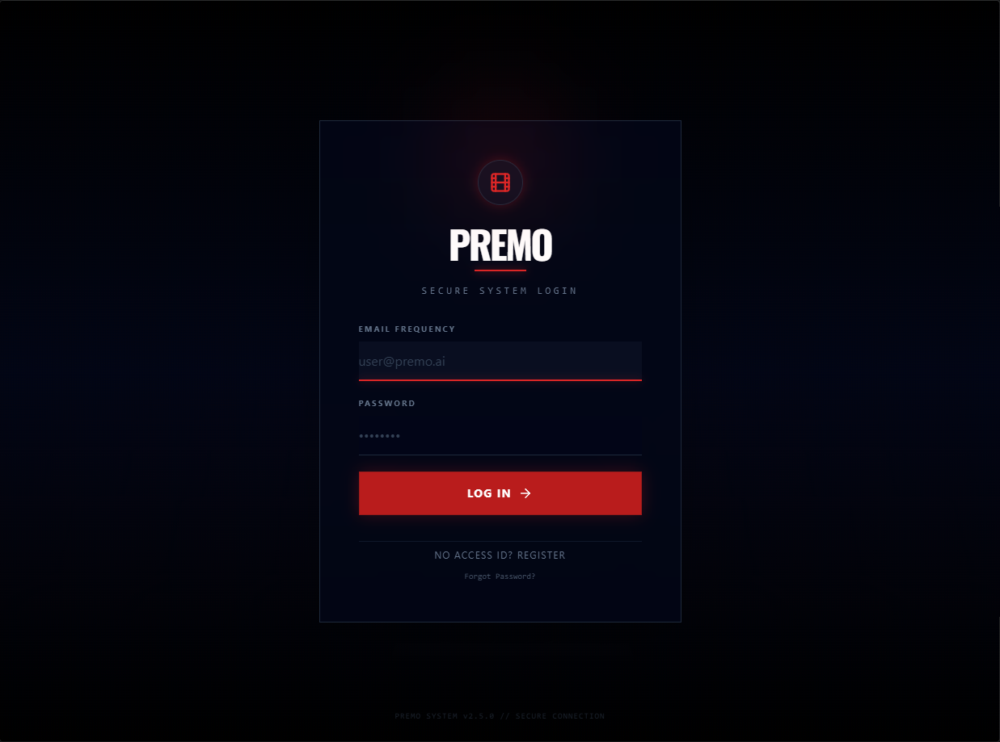
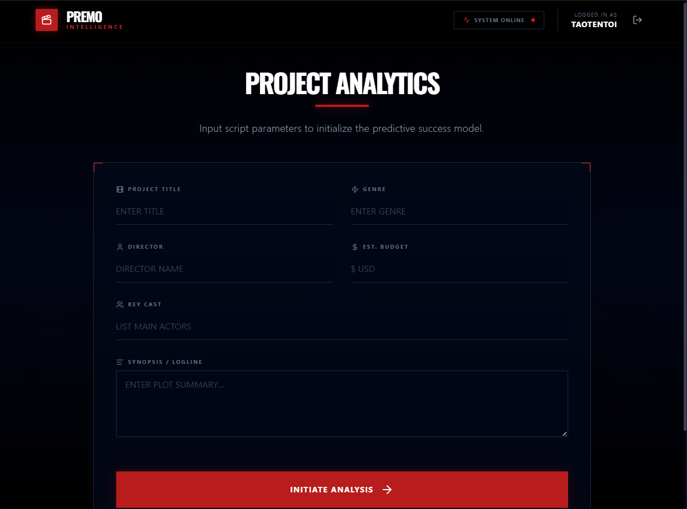

# 🎬 Movie Success Prediction System

## 📝 About the Project
This application leverages artificial intelligence to predict the box office potential of movies. By analyzing input parameters like budget, genre, cast, and director using advanced language models (Gemini API), it provides insights into whether a project will be a **Flop**, **Hit**, or **Super Hit**. It helps producers and investors evaluate risk and potential success based on historical and contextual patterns.

---

## 🛠️ Tech Stack
* **Frontend:** React, TypeScript, Vite, Tailwind CSS, Recharts, Lucide React
* **Backend:** Django, Python
* **Database:** MySQL
* **Integration:** Google Gemini API (AI Analysis)

---

## 🖼️ Demo
### 1. Login/Registration Interface


### 2. Main Prediction Functionality


---

## 🚀 Run Locally
### Requirements
* Python 3.10+
* MySQL
* Node.js & npm

### Steps
#### 1. Backend Setup
```bash
# Setup database and model
python manage.py migrate
python train_model.py

# Run Django server
python manage.py runserver
```

#### 2. Frontend Setup
```bash
npm install
npm run dev
```

Open: **[http://localhost:3000](http://localhost:3000)**

---

Built by Group 3 – Movie Success Prediction Project